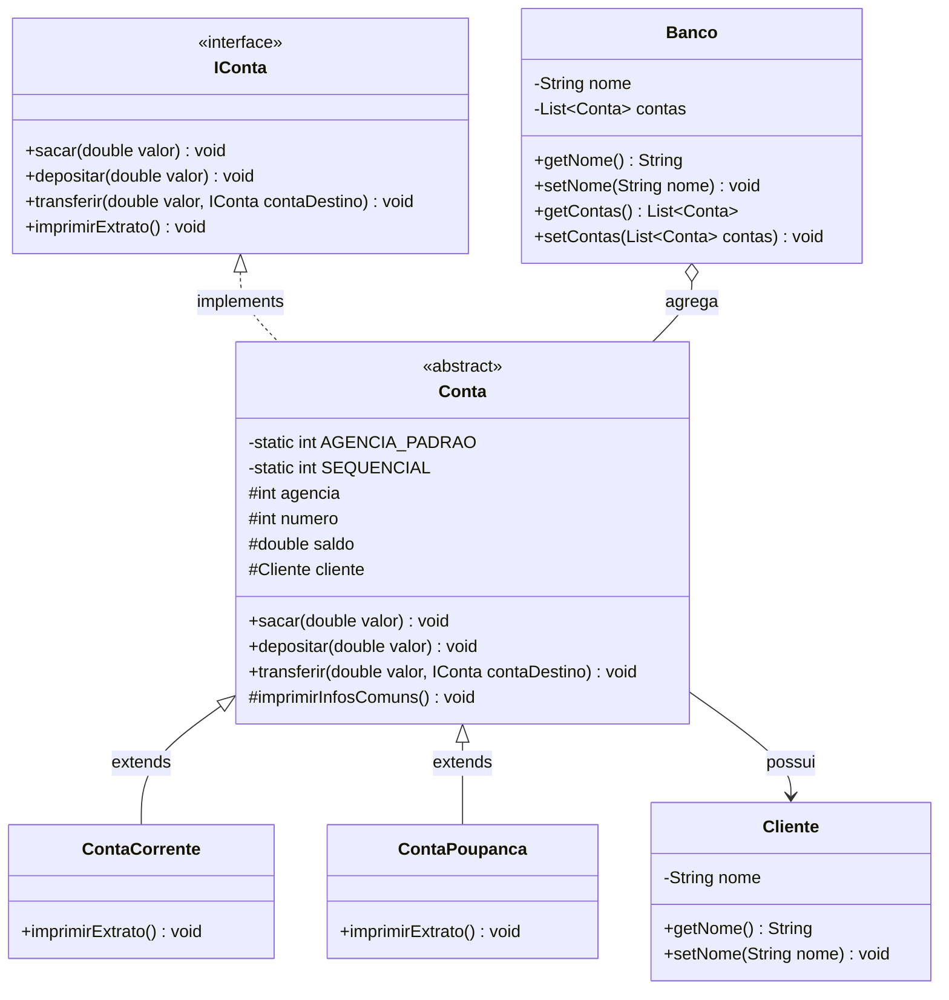

# 🏦 Banco Digital — Simulação Bancária em Java POO


---

## 📖 Visão Geral

O **Desafio-Banco-Dio** é um projeto prático desenvolvido em **Java**, modelado para demonstrar a aplicação sólida dos conceitos de **Programação Orientada a Objetos (POO)** na criação de um sistema de simulação de banco digital.

Criado como solução para o desafio de código do bootcamp da **Digital Innovation One (DIO)**, o software implementa um domínio bancário simplificado, contemplando a gestão de clientes, contas correntes e contas poupança, com operações de depósito, saque, transferência entre contas e impressão de extratos financeiros consolidados.

---

## ✨ Funcionalidades

* 👤 **Gestão de Clientes & Titulares:** Cadastro e associação de clientes a contas bancárias.
* 💳 **Segregação de Tipos de Conta:**
  * **Conta Corrente:** Destinada a movimentações do dia a dia.
  * **Conta Poupança:** Destinada a reserva financeira.
* 🔢 **Numeração Automática e Sequencial:** Mecanismo estático (`SEQUENCIAL = 1`) que gera automaticamente um número de conta exclusivo e sequencial a cada nova instância criada.
* 💵 **Operações Financeiras Fundamentais:**
  * **Depósito (`depositar`):** Incremento de saldo da conta.
  * **Saque (`sacar`):** Retirada de recursos deduzindo do saldo disponível.
  * **Transferência (`transferir`):** Operação atômica que saca da conta de origem e deposita na conta de destino via contrato de interface.
  * **Extrato Detalhado (`imprimirExtrato`):** Exibição no console dos dados do titular, número da agência, número da conta e saldo atualizado.

---

## 🎯 Pilares da Programação Orientada a Objetos (POO)

O projeto serve como um modelo didático claro dos 4 pilares fundamentais da POO:

1. **Abstração:**
   * A interface `IConta` define o contrato operacional que qualquer conta do banco deve cumprir (`sacar`, `depositar`, `transferir`, `imprimirExtrato`).
   * A classe abstrata `Conta` encapsula o estado essencial e implementa o comportamento padrão de uma conta genérica.
2. **Encapsulamento:**
   * Atributos críticos como `saldo`, `agencia` e `numero` são protegidos (`protected` / `private`), impedindo atribuições diretas de valores de fora da classe e garantindo que alterações de saldo passem obrigatoriamente pelos métodos validadores de saque e depósito.
3. **Herança:**
   * As classes especializadas `ContaCorrente` e `ContaPoupanca` herdam todos os atributos e métodos da classe base `Conta`, estendendo suas particularidades na implementação do extrato.
4. **Polimorfismo:**
   * O método de transferência recebe um destino tipado como `IConta`:
     ```java
     @Override
     public void transferir(double valor, IConta contaDestino) {
         this.sacar(valor);
         contaDestino.depositar(valor);
     }
     ```
     Isso permite transferir valores entre Contas Correntes, entre Contas Poupança ou de forma cruzada sem duplicar código.

---

## 🏗️ Estrutura do Repositório

```text
Desafio-Banco-Dio/
├── src/
│   ├── Banco.java          # Entidade agregadora com nome e lista de contas
│   ├── Cliente.java        # Entidade representando o titular da conta
│   ├── IConta.java         # Interface com os métodos obrigatórios de conta
│   ├── Conta.java          # Classe abstrata base com lógica de movimentações e numeração
│   ├── ContaCorrente.java  # Especialização de Conta Corrente
│   ├── ContaPoupanca.java  # Especialização de Conta Poupança
│   └── Main.java           # Ponto de entrada executando o fluxo de simulação
├── .gitignore              # Arquivos ignorados pelo Git
└── README.md               # Documentação técnica consolidada do projeto
```

---

## 🎲 Diagrama de Classes (UML)



---

## ⚙️ Requisitos e Compilação

### Pré-requisitos
* **Java Development Kit (JDK):** Versão 11 ou superior.
* **Terminal / Prompt de Comando:** Ou qualquer IDE Java (IntelliJ IDEA, Eclipse, VS Code).

### 1. Clonar o Repositório
```bash
git clone https://github.com/erickystn/Desafio-Banco-Dio.git
cd Desafio-Banco-Dio
```

### 2. Compilar os Arquivos Java
```bash
javac src/*.java -d bin
```

---

## 🚀 Como Executar

Após a compilação, execute a classe `Main`:

```bash
java -cp bin Main
```

---

## 💻 Saída Esperada no Console

Ao executar o método `main`, o programa realiza um depósito inicial de R$ 100,00 na Conta Corrente, transfere integralmente os R$ 100,00 para a Conta Poupança e imprime os extratos:

```text
=== Extrato Conta Corrente ===
Titular: Erick
Agencia: 1
Numero: 1
Saldo: 0.00

=== Extrato Conta Poupança ===
Titular: Erick
Agencia: 1
Numero: 2
Saldo: 100.00
```

---

## 📈 Próximos Passos de Evolução (Roadmap)

- [ ] Implementação de limite de cheque especial com validação de saque a descoberto.
- [ ] Cálculo de rendimento automático mensal na Conta Poupança.
- [ ] Cobrança de tarifas administrativas em transações de Conta Corrente.
- [ ] Histórico de transações individuais (extrato analítico com data e descrição).
- [ ] Interface gráfica (GUI) ou menu interativo via CLI.

---

## 👤 Autor & 📄 Licença

Desenvolvido por **[Ericky Sant'ana](https://github.com/erickystn)** como Desafio de Projeto da **Digital Innovation One (DIO)**.

Distribuído sob a licença **MIT**.
